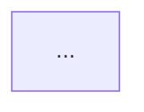

# Mermaid Excel Generator
Generate Mermaid diagrams dynamically from structured data in Excel using Power Query. This tool is intended for restricted software environments where there is only access to the Microsoft suite. 

You define nodes and relationships in tables, then PowerQuery outputs a complete mermaid diagram code ready to copy and paste into a mermaid renderer. Copilot was used to generate the PowerQuery M Language script and documentation, which was subsequently verified and edited by me. 

## Downloading This Project (For Users New to GitHub)
If you’re not familiar with GitHub, you can download the entire project as a ZIP file without needing an account.

### How to download:
1. Go to the repository homepage: https://github.com/heidiwwang/mermaid_excel
2. Click the green Code button near the top right.
3. Select Download ZIP.
4. Save the file to your computer.
5. Extract (unzip) the folder.
6. Open the Excel workbook inside the extracted folder.

You now have everything you need to explore the Mermaid generator.

## Viewing the Sample Rendered Diagram

The repository includes a ready‑to‑view example Mermaid diagram so you can see what the Excel + Power Query model produces.

To view the example:
1. In the repository file list, click sample_starwars.md.
2. GitHub will automatically render the Mermaid diagram inside the page.
3. Scroll to see the full graph generated from the Star Wars sample data.

This example dprovides a quick way to understand what the tool can do before you start editing your own data.

## How It Works

### 1. Entities table ("Entities")

Columns:
- NodeID — unique identifier used in Mermaid
- DisplayName — human‑readable label
- CssClass — optional Mermaid class for styling
- Class — a property displayed under the node
- Comment — a property displayed under the node
 
You can add any additional columns, and they will automatically appear as "+ property: value" inside the node.

### 2. Relationships table ("Relationships")

Columns:

- SourceNodeID
- RelationshipLabel
- TargetNodeID

NodeID in the Entities table is used to generate Mermaid edges:
```
A-->|" relates_to "|B
```
### 3. Output with md fence ("output_mdfence")
Outputs a single Markdown‑ready Mermaid block

````

````
### 4. Output without fence ("output_nofence")
Outputs a Mermaid code without code fence for pasting into [Mermaid Live Editor](https://mermaid.live/edit) or similar

```
graph TD
  ...
```


## Suggestion for Automation with for Diagram Publishing with Power Automate + GitHub
Not included in this repo, but entirely possible if you have similar limitations on rendering Mermaid diagrams internally, but have access to M365, and don't want to copy-paste back and forth...

I think what I'm going to do to make diagrams available as part of our communications to internal stakeholder is:
- Power Query generates the Mermaid block
- Power Automate reads the output
- Power Automate commits a .md or .html file to GitHub
- GitHub renders the diagram natively
- (Optional) GitHub Pages hosts a clean HTML version
- SharePoint can embed the rendered GitHub page

This gives you a fully automated diagram‑as‑code workflow using only Excel + Power Automate + GitHub.
