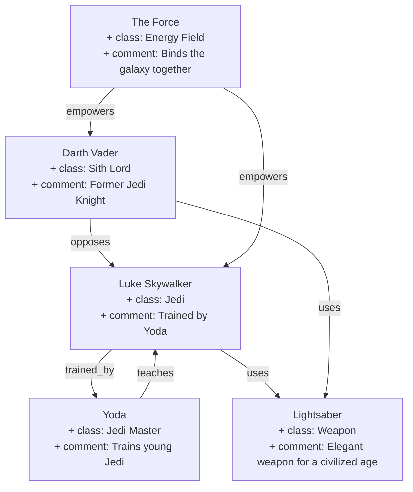

```mermaid
graph TD
Luke_Skywalker[""Luke Skywalker<br>+ class: Jedi<br>+ comment: Trained by Yoda""]:::hero-node
Darth_Vader[""Darth Vader<br>+ class: Sith Lord<br>+ comment: Former Jedi Knight""]:::villain-node
Yoda[""Yoda<br>+ class: Jedi Master<br>+ comment: Trains young Jedi""]:::mentor-node
The_Force[""The Force<br>+ class: Energy Field<br>+ comment: Binds the galaxy together""]:::concept-node
Lightsaber[""Lightsaber<br>+ class: Weapon<br>+ comment: Elegant weapon for a civilized age""]:::object-node
Luke_Skywalker-->|"" trained_by ""|Yoda
Darth_Vader-->|"" opposes ""|Luke_Skywalker
Luke_Skywalker-->|"" uses ""|Lightsaber
Darth_Vader-->|"" uses ""|Lightsaber
Yoda-->|"" teaches ""|Luke_Skywalker
The_Force-->|"" empowers ""|Luke_Skywalker
The_Force-->|"" empowers ""|Darth_Vader
```

